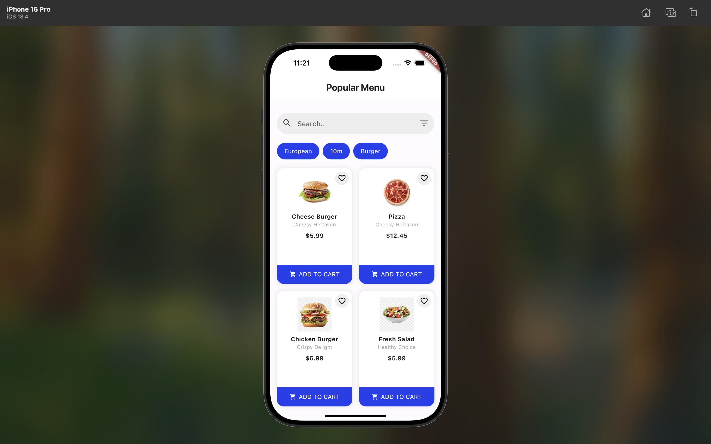

# Food Ordering App UI

A beautiful Flutter app for browsing and ordering food from a restaurant.  
This project focuses on creating a clean, responsive, and smooth food ordering UI using Flutter.

---

## 📱 Screenshots

| Home Screen |
|:-----------:|



---

## Features
- Browse food menus from the restaurant.
- Add items to the cart.
- View and edit cart items.
- Smooth and fully responsive UI design.

---

## Tech Stack
- Flutter (latest stable version)
- Dart
- (Optional) Firebase (for backend services)
- (Optional) Bloc (for state management)

---

## Installation

1. Clone the repository:
```bash
git clone https://github.com/manaalq/Food-Ordering-App-UI.git


---

## How to Use
- Open the app on your device or simulator.
- Browse the available menu items.
- Add your favorite items to the cart.
- View and edit your cart before checkout.


---

## Author
- Manal Almarri
- [GitHub Profile](https://github.com/manaalq)

---
