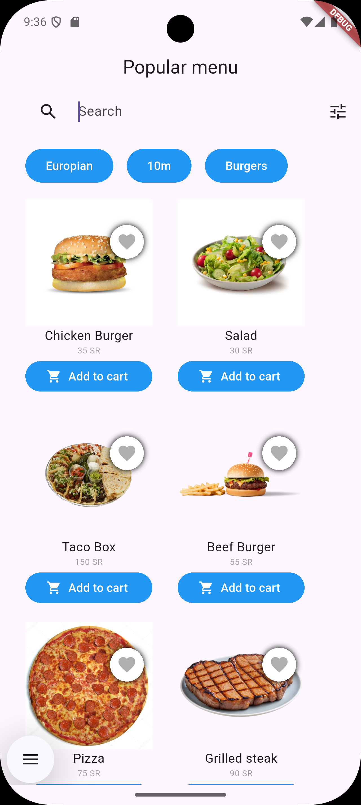

# Food Ordering App UI 🍔📱

A beatiful Flutter app for browsing and ordering food from a café.

---



---

## 📱 Features

Your screen must include:

- ✅ **Browsing** – The main title on the AppBar Shows **Popular Menu** and the user can Browse through it ! .
- ✅ **Search Bar** – A field were the user can enter inputs to search for an item.
- ✅ **Filter options icon** – A filter option to make search easier for the user .
- ✅ **Filter by catagory** – A small boxes for the user to choose so they can filter the items in the menu. 
- ✅ **Favorite Button** – Allow users to favorite an item using a heart icon.

---

## 💻 Tech

- **Flutter** 
- **Dart**
 

---
## 💻 installation

1-All you have to do is to install dart and flutter from [HERE](https://dart.dev/get-dart).

2- download [Android Studio](https://developer.android.com/studio?hl=ar) to play the emulator or you can use any emulator you like.

3- 
```
git clone https://github.com/AymanAlzahrani/Food-Ordering-App-UI.git
 ```


4- 
```
 cd desktop/Food-Ordering-App-UI/assignment6
```
5-
```
code .
```

6-

```
flutter run
```

7-Make a cup of tea because you made it 🍵 

---

## ✨ Written by Ayman Alzahrani

plaese if you have any suggestions contact me <a href="mailto:aymangormallah@gmail.com">Here.</a>


