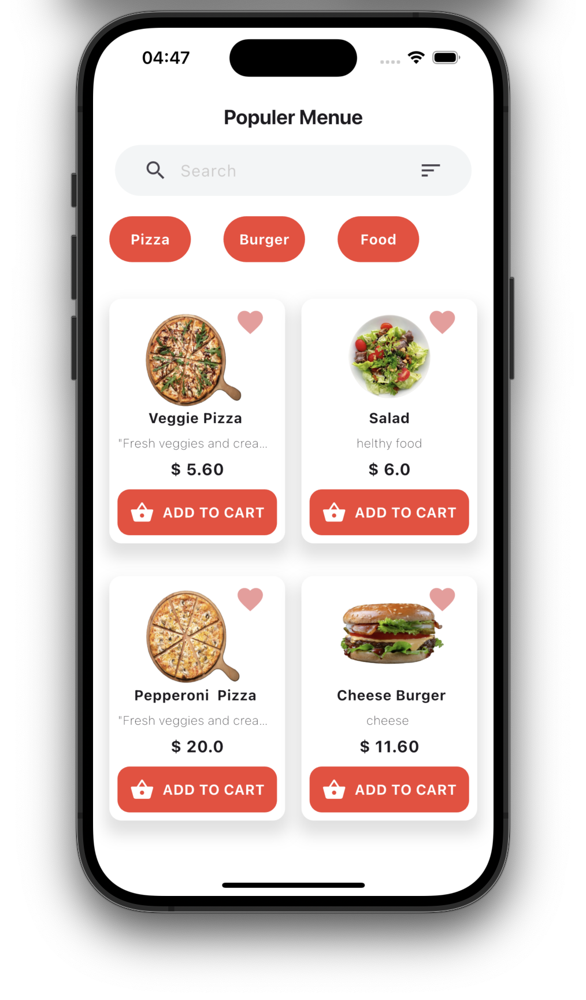
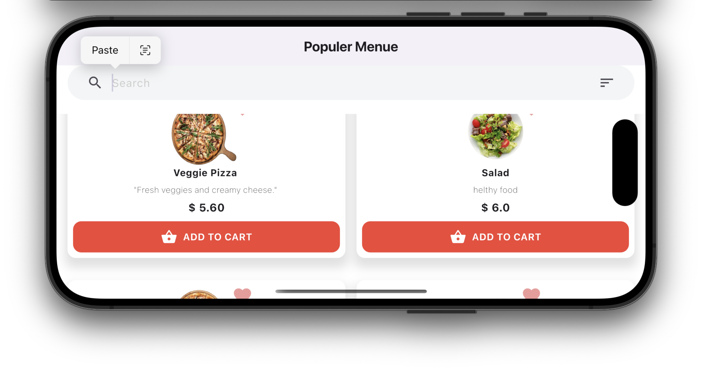

# Food Ordering Flutter App

A beautiful Flutter app for browsing and ordering food from a restrunt.

---

## 🔄 Forked From
This project is forked from the original repository: [Food Ordering App UI](https://github.com/Flutter-13Aprill/Food-Ordering-App-UI.git)


---

## 📱 Screenshots
| Populer Screen | 
|----------------|
|  |
|  |

---

## ✨ Features
- Browse food and beverage menus.
- Add items to the cart.
- View and edit cart items.
- Smooth and responsive UI design.

---

## 🛠 Tech Stack
- Flutter (latest version)
- Dart

---

## 🚀 Installation


1. Clone the repository:
   ```bash
   git clone https://github.com/Norah200/Food-Ordering-App-UI.git


Install dependencies:
flutter pub get

Run the app:
flutter run

📂 Folder Structure
lib/
├── screens/
├── widgets/
├── main.dart

📋 How to Use
Open the app.
Browse through available menu items.
Add your favorite items to the cart.

👨‍💻 Author: Norah200  (GitHub: [Norah200](https://github.com/Norah200))

