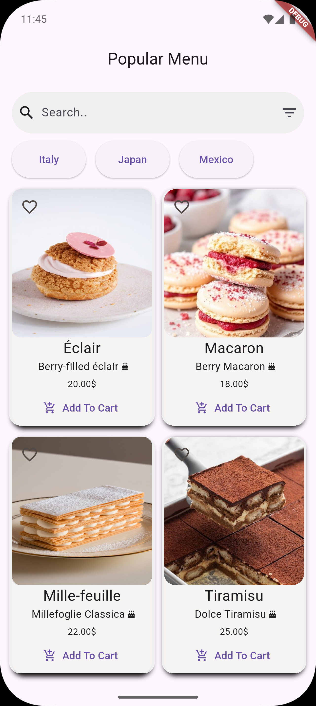

# Popular Menu App

Welcome to **Popular Menu** — a sweet Flutter application that displays a collection of popular desserts from around the world with a beautiful user interface.

## Overview
This project focuses on building a clean and elegant UI to showcase desserts like Éclair, Macaron, Mille-feuille, and Tiramisu.  
It includes product images, names, short descriptions, prices, and an "Add to Cart" button.

## Screens
- Home Screen featuring:
  - Search Bar
  - Category Filters (Italy, Japan, Mexico)
  - Product Cards (Image + Name + Description + Price + Add to Cart Button)

## Featured Desserts
- **Éclair** — Berry-filled éclairs.
- **Macaron** — Colorful berry macarons.
- **Mille-feuille** — Layered buttery pastry.
- **Tiramisu** — Classic Italian coffee dessert.

## Features
- Beautiful and responsive design.
- Organized product display with clean layout.
- Ready for future enhancements (cart functionality, database connection, etc.).

# Screenshots

## Built With
- Flutter
- Dart

## How to Run
1. Clone the repository.
2. Run `flutter pub get` to fetch dependencies.
3. Run the app using `flutter run`.

## Author
Made with love by **Raghad Bassam**.

---